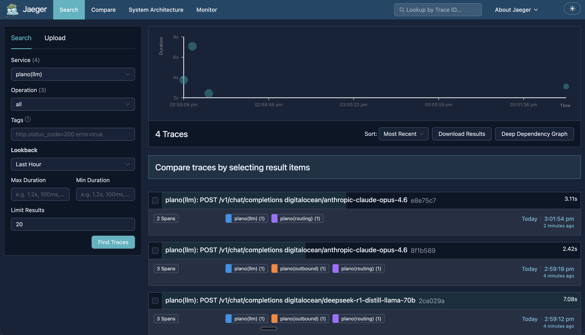
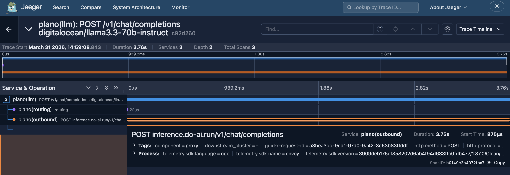

# 02 - Multi-Model Routing + Observability

Route different tasks to different DO models through a single Plano gateway, with full tracing visualized in Jaeger.

## Architecture

```
Client (one endpoint: localhost:12000)
  │
  ├─ "Write a story"  → Plano → llama3.3-70b ($0.65/1M)
  ├─ "Solve 127*49"   → Plano → deepseek-r1-70b ($0.99/1M)
  └─ "Write a haiku"  → Plano → anthropic-claude-opus-4.6 ($5/$25 per 1M)
                │
                └→ Traces sent to Jaeger (localhost:16686)
```

## Models

| Model | Best for | Cost |
|-------|----------|------|
| `llama3.3-70b-instruct` | Creative writing, general tasks | $0.65/1M tokens |
| `deepseek-r1-distill-llama-70b` | Math, reasoning, editing | $0.99/1M tokens |
| `anthropic-claude-opus-4.6` | Premium creative, complex tasks | $5/$25 per 1M tokens |

All models accessed via DO Serverless Inference — same endpoint, same API key. Anthropic Opus 4.6 is available as a DO pass-through.

## Setup

```bash
# 1. Set your DO Model Access Key
export DO_MODEL_ACCESS_KEY="dop_v1_..."

# 2. Start Jaeger for trace visualization
docker run -d \
  --name jaeger \
  -p 16686:16686 \
  -p 4317:4317 \
  jaegertracing/jaeger:latest

# 3. Start Plano with tracing enabled
planoai up config.yaml --with-tracing

# 4. Send test requests (in another terminal)
uv run test.py
```

## Test manually

```bash
# Llama 3.3 — creative
curl http://localhost:12000/v1/chat/completions \
  -H "Content-Type: application/json" \
  -d '{"model":"digitalocean/llama3.3-70b-instruct","messages":[{"role":"user","content":"Write a 2-sentence bedtime story about a dragon."}],"max_tokens":100}'

# DeepSeek R1 — reasoning
curl http://localhost:12000/v1/chat/completions \
  -H "Content-Type: application/json" \
  -d '{"model":"digitalocean/deepseek-r1-distill-llama-70b","messages":[{"role":"user","content":"What is 127 * 49? Show step-by-step."}],"max_tokens":200}'

# Opus 4.6 — premium
curl http://localhost:12000/v1/chat/completions \
  -H "Content-Type: application/json" \
  -d '{"model":"digitalocean/anthropic-claude-opus-4.6","messages":[{"role":"user","content":"Write a haiku about cloud computing."}],"max_tokens":100}'
```

## Observability with Jaeger

Open `http://localhost:16686` in your browser to see the Jaeger trace UI.

### Trace list view

Select **Service: `plano(llm)`** and click **Find Traces** to see all requests. Each trace shows which model was called, how many spans, and total duration.



### Trace detail view

Click into a trace to see the full request lifecycle:

- **`plano(llm)`** — the incoming request with model name and user message preview
- **`plano(routing)`** — the routing decision (22μs)
- **`plano(outbound)`** — the actual call to `inference.do-ai.run` with HTTP status, request/response size



### CLI traces

You can also watch traces in the terminal:

```bash
planoai trace              # Most recent trace
planoai trace --list       # List all trace IDs
planoai trace --verbose    # Full span attributes
```

## What this proves

- **Unified gateway** — one endpoint routes to 3 different DO models
- **Observability** — every request is traced with zero instrumentation code
- **Jaeger visualization** — full request lifecycle visible in a web UI
- **Zero vendor lock-in** — swap models by changing config, not code
- **All DO-native** — Llama, DeepSeek, and Anthropic Opus all via DO Serverless Inference
