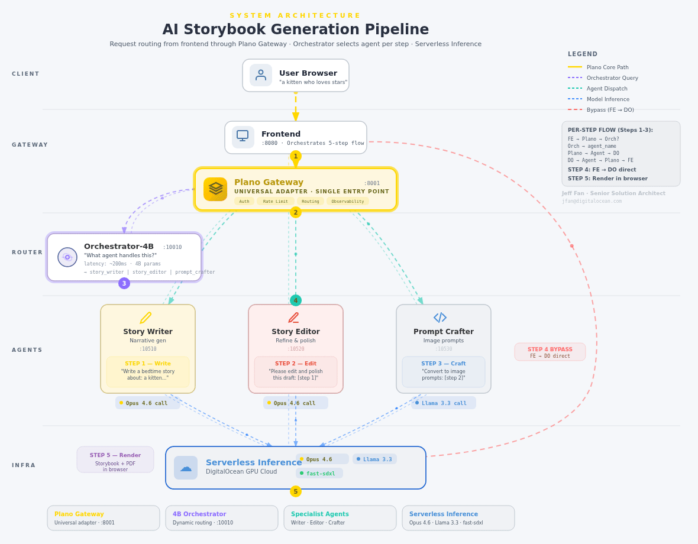
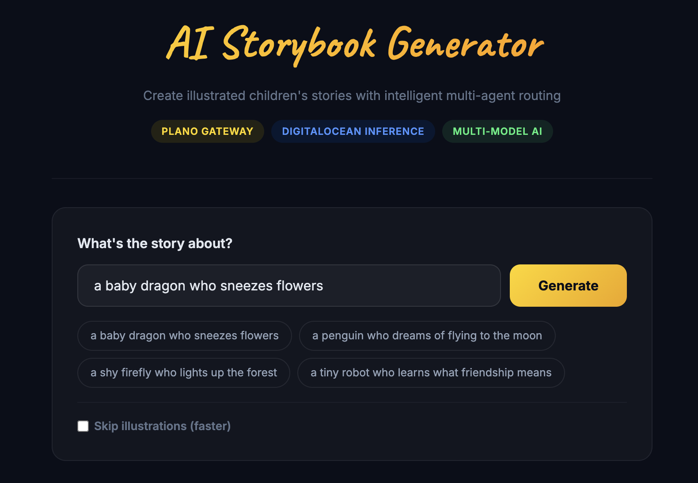

# Plano on DigitalOcean

Build intelligent multi-agent AI systems with [Plano](https://planoai.dev) + [DigitalOcean Serverless Inference](https://docs.digitalocean.com/products/gradient-ai-platform/how-to/use-serverless-inference/). One gateway, multiple agents, automatic routing — all on DigitalOcean.

## Architecture



**How it works:** The user sends a message through one endpoint. Plano's self-hosted 4B orchestrator model analyzes the intent and automatically routes to the right agent. Each agent calls the best LLM for its task via DigitalOcean Serverless Inference. The user never specifies which agent or model to use.

## Labs

| Lab | What it teaches | Key concept |
|-----|-----------------|-------------|
| [`01-quickstart`](01-quickstart/) | Basic Plano proxy to DO Inference | Plano installs and routes |
| [`02-multi-model-routing`](02-multi-model-routing/) | Multiple models + Jaeger tracing | `type: model` gateway + observability |
| [`03-agent-orchestration`](03-agent-orchestration/) | Intelligent routing with 4B orchestrator | `type: agent` + self-hosted Plano-Orchestrator-4B |
| [`frontend`](frontend/) | Web UI for the storybook generator | FastAPI + vanilla JS |
| [`docs`](docs/) | Tutorial writeup | Full walkthrough |

## The Demo: AI Storybook Generator


Users type a story theme, and the system automatically:

1. **Routes to Story Writer** (Opus 4.6) — drafts a 4-page bedtime story
2. **Routes to Story Editor** (Opus 4.6) — polishes prose and pacing
3. **Routes to Prompt Crafter** (Llama 3.3) — generates image prompts as JSON
4. **Generates illustrations** (fal-ai/fast-sdxl) — watercolor-style images
5. **Renders a storybook** — viewable in browser, downloadable as PDF

All routing decisions made by Plano's orchestrator in ~200ms. All models on DigitalOcean.

## Prerequisites

- **DigitalOcean GPU Droplet** (RTX 6000 Ada or similar)
- **DO Model Access Key** (Control Panel → Gen AI → Model Access Keys)
- **Docker** with NVIDIA Container Toolkit
- **[uv](https://github.com/astral-sh/uv)** for Python tooling
- **Plano CLI**: `uv tool install planoai`

## Quick Start

```bash
# 1. Set credentials
export DO_MODEL_ACCESS_KEY="dop_v1_..."

# 2. Start the orchestrator model on vLLM
docker run -d --name vllm-orchestrator --gpus all -p 10010:8000 \
  -v ~/.cache/huggingface:/root/.cache/huggingface \
  -v ~/plano-orchestrator:/templates \
  vllm/vllm-openai:latest \
  --model katanemo/Plano-Orchestrator-4B \
  --chat-template /templates/chat_template.jinja \
  --served-model-name katanemo/Plano-Orchestrator-4B \
  --gpu-memory-utilization 0.3 --max-model-len 4096 \
  --enable-prefix-caching

# 3. Start agent services
cd 03-agent-orchestration
uv run uvicorn agents.story_writer:app --port 10510 &
uv run uvicorn agents.story_editor:app --port 10520 &
uv run uvicorn agents.prompt_crafter:app --port 10530 &

# 4. Start Plano with tracing
planoai up config.yaml --with-tracing

# 5. Start frontend
cd ../frontend
uv run uvicorn app:app --port 8080 &

# 6. Open http://localhost:8080
```

## Models on DigitalOcean

All models accessed via `inference.do-ai.run` with one API key. No third-party accounts needed.

| Model | Role | Cost |
|-------|------|------|
| `anthropic-claude-opus-4.6` | Story writing + editing | $5/$25 per 1M tokens |
| `llama3.3-70b-instruct` | Structured output (JSON) | $0.65/1M tokens |
| `deepseek-r1-distill-llama-70b` | Reasoning tasks | $0.99/1M tokens |
| `fal-ai/fast-sdxl` | Image generation | ~$0.001/image |
| `Plano-Orchestrator-4B` | Routing decisions | Self-hosted on GPU |
